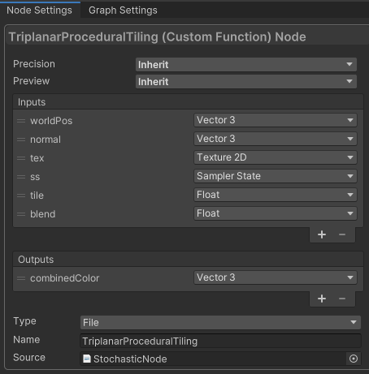

# Unity Shader Graph Custom Function Node for Procedural Stochastic Tiling
A simple HLSL file for use in Unity's Shader Graph.

## Installation
Simply drag and drop "StochasticNode.hlsl" into any Unity assets folder.

## Usage
1. Open the Shader Graph window.
2. Right-click on the background and select "Create Node."
3. Search for the "Custom Function" node and add it to the graph.
4. Configure the parameters as shown in the following image.
5. Select the texture you wish to use and drag the output to the "Base Color" input.

## Disclaimer
This is an unofficial implementation based on the paper "[Procedural Stochastic Textures by Tiling and Blending](https://eheitzresearch.wordpress.com/738-2/)" by Thomas Deliot and Eric Heitz.
This implementation only includes the tiling part of the original paper. The blending part is not implemented.
The majority of the code was developed with assistance from GPT-4.
